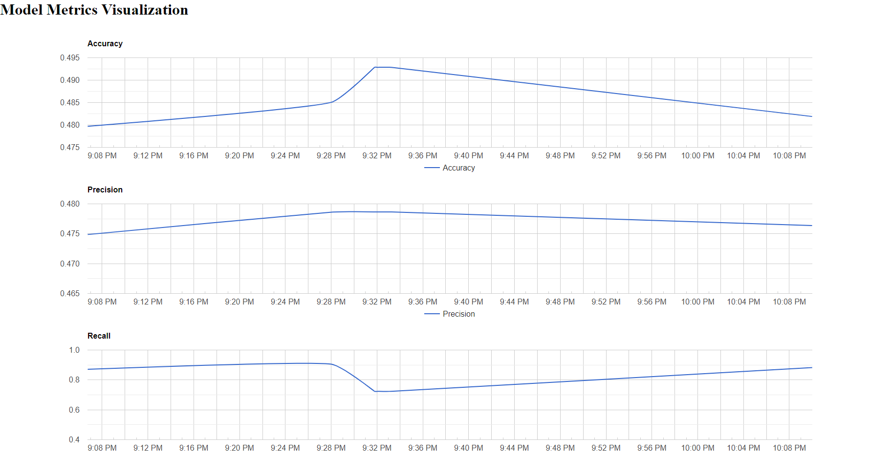

# Stock Market ML App

## Prerequisites

Before you begin, make sure you have the following installed on your machine:

- Docker: [Install Docker](https://docs.docker.com/get-docker/)
- Docker Compose: [Install Docker Compose](https://docs.docker.com/compose/install/)

## Getting Started

1. **Clone the repository:**

    ```bash
    git clone https://github.com/vkmguy/ml_training_hub.git
    cd ml_training_hub
    ```

3. **Build and start the services:**

    ```bash
    docker-compose up --build
    ```

   This command will build the Docker images and start the services.

4. **Access your application:**
    - Django Admin: [localhost:8001/admin](http://localhost:8001/admin) (setup your username and password)
   ```bash
   docker exec -it mlTrainingHub bash
   python manage.py createsuperuser
   ```
5. **To stop the services, press `Ctrl + C` in the terminal where `docker-compose` is running.**

## Services

### Django Web App

The Django web app allows you to interact with the Stock Market ML model.

- GET request to train the ML model: [localhost:8001/api/trainModel](http://localhost:8001/api/trainModel)
- GET request to get the last 10 ML model
  accuracies: [localhost:8001/api/accuracies](http://localhost:8001/api/accuracies)
- POST request to predict the direction of market: [localhost:8001/api/predict](http://localhost:8001/api/predict)
   ```json
  {
    "open": 0.11,
    "low": 0.1,
    "high": 0.11,
    "volume": 202048089,
    "dividends": 0,
    "stock_splits": 0
  }
  ```
   ```json
  {
    "prediction": 0.0
  }
  ```
- GET request to train the ML model: [localhost:8001/api/trainModel](https:localhost:8001/api/trainModel)
   ```json
  {
  "message": "ML model training task has been triggered successfully."
  }
  ```
- GET request to fetch the ML model accuracy: [localhost:8001/api/accuracies](http://localhost:8001/api/accuracies)
     ```json
  [
    {
        "metrics": {
            "recall": 0.8824884792626728,
            "accuracy": 0.4818880351262349,
            "precision": 0.4763681592039801
        },
        "timestamp": "2024-02-07T21:09:59.251336Z"
    },
    {
        "metrics": {
            "recall": 0.7235023041474654,
            "accuracy": 0.49286498353457736,
            "precision": 0.47865853658536583
        },
        "timestamp": "2024-02-07T20:33:16.008314Z"
    }
    ]
  ```
    - GET model visualization for its
      metrics: [localhost:8001/visualization](http://localhost:8001/visualization)
      

### Celery Worker

The Celery worker processes asynchronous tasks, such as training the ML model. Check the Celery container for logs and
task execution.

- start celery beat and worker so that the jobs can be scheduled, inside the docerk container

```bash
  docker exec -it mlTrainingHub bash
  celery -A ml_training_hub beat --detach
  celery -A ml_training_hub worker --detach
```

## Troubleshooting

- If you encounter issues, check the logs of individual containers for more details.

## License

This project is licensed under the [MIT License](LICENSE).
